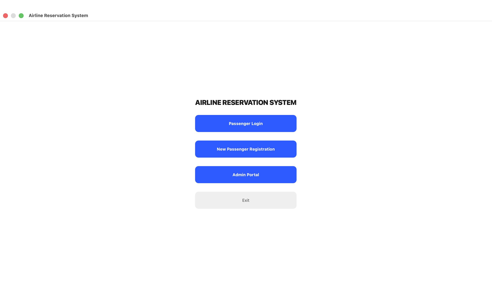
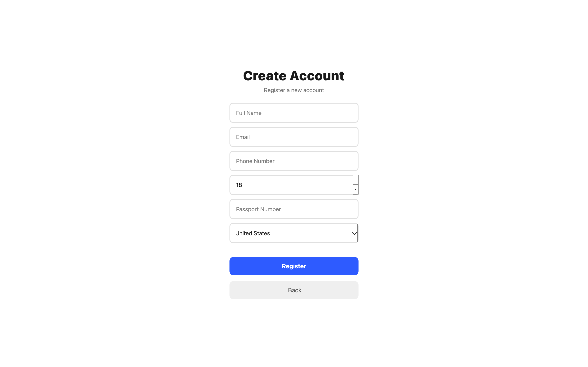
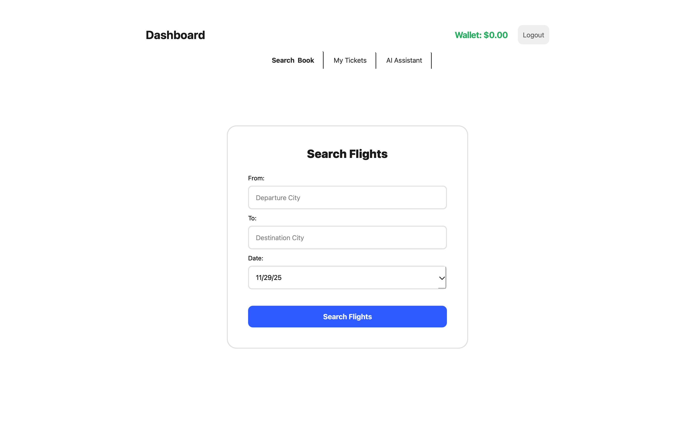
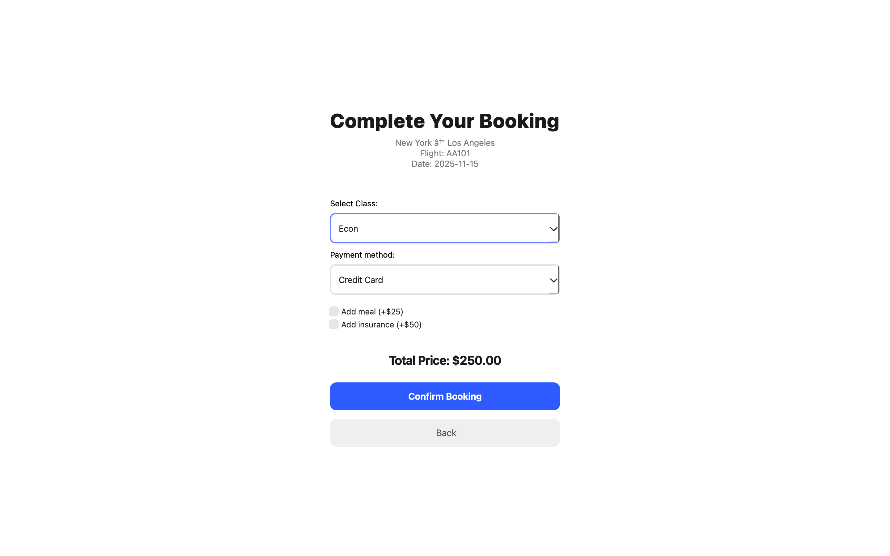
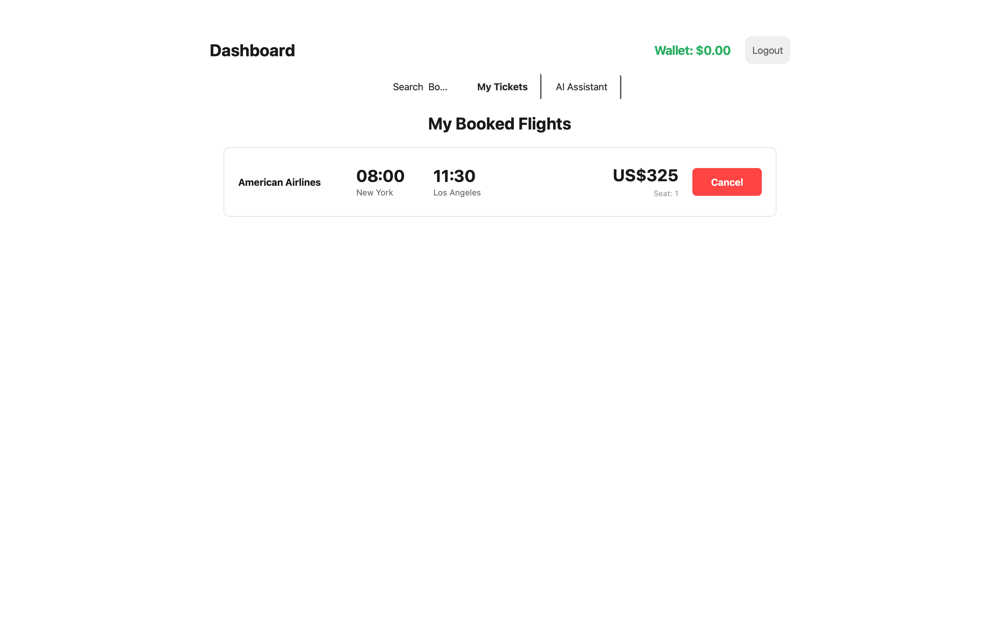
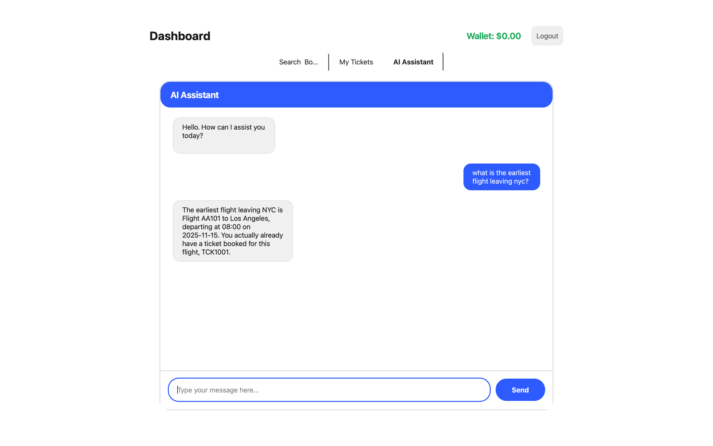

# Airline Reservation System + Chatbot

A comprehensive airline reservation system built with Qt6, featuring a chatbot assistant that uses RAG (Retrieval-Augmented Generation) architecture with semantic search and LLM technology to help users with bookings, policies, and flight information.

---

## Project Overview

This project is a full-featured airline reservation system with a modern GUI built using Qt Widgets. It includes:

- **Passenger Portal**: Search flights, book tickets, manage bookings, wallet system
- **Admin Portal**: Add/update flights, manage flight status, view all bookings
- **AI Chatbot Assistant**: RAG-based system powered by ONNX Runtime (sentence-transformers) and Groq LLM API
  - Semantic search using sentence embeddings over airline policies
  - Context-aware responses combining retrieved knowledge with real-time flight/booking data
  - Conversational memory for multi-turn interactions
  - Retrieval-Augmented Generation for accurate, grounded responses

---

## Layout

These are some screenshots of the app.

<p align="center">
  
  
</p>


<p align="center">
  
  

</p>

<p align="center">
  
  
</p>


---

## Features

### For Passengers
- login and registration system
- Search flights by source, destination, and date
- Book flights 
- AI chatbot assistant for instant help

### For Admins
- View all flights and bookings
- Add new flights to the system
- Update flight details

### AI Chatbot Features
- **Retrieval Phase**: Semantic search using sentence-transformers (all-MiniLM-L6-v2) model via ONNX Runtime
- **Generation Phase**: Natural language generation powered by Groq's Llama 3.3 70B model
- **Knowledge Base**: Pre-indexed airline policies (baggage, cancellation, check-in, meals, insurance)
- **Real-time Data Integration**: Combines retrieved policy documents with live flight and booking data
- **Context-aware responses**: RAG system grounds LLM responses in factual data
- **Conversational memory**: Maintains conversation history for follow-up questions
- **Intent detection**: Uses semantic similarity for query understanding

---

## Requirements

1. **Qt6** (Core, GUI, Widgets, Network)
   ```bash
   # macOS with Homebrew
   brew install qt@6
   
   # Linux
   sudo apt-get install qt6-base-dev qt6-base-dev-tools
   
   # Windows
   # Download Qt installer from https://www.qt.io/download
   ```

2. **ONNX Runtime** (v1.16.3 or compatible)
   - Download from: https://github.com/microsoft/onnxruntime/releases
   - Choose the appropriate version for your platform.

3. **JsonCpp**
   ```bash
   # macOS with Homebrew
   brew install jsoncpp
   
   # Linux
   sudo apt-get install libjsoncpp-dev
   
   # Windows
   # Use vcpkg: vcpkg install jsoncpp
   ```

4. **libcurl**
   ```bash
   # macOS with Homebrew
   brew install curl
   
   # Linux
   sudo apt-get install libcurl4-openssl-dev
   
   # Windows
   # Use vcpkg: vcpkg install curl
   ```

### Python Dependencies (for model conversion)
```bash
pip install torch transformers onnx
```

---

## Installation

### 1. Clone the Repository
```bash
git clone https://github.com/Mahdi-Razi-Gandomani/Airline_Res_System.git
cd Airline_Res_System
```

### 2. Download ONNX Runtime
- Download ONNX Runtime for your platform from [GitHub Releases](https://github.com/microsoft/onnxruntime/releases/tag/v1.16.3)
- Extract to project root directory
- Rename folder to match your platform:
  - macOS ARM64: `onnxruntime-osx-arm64-1.16.3/`
  - macOS Intel: `onnxruntime-osx-x86_64-1.16.3/`
  - Linux: `onnxruntime-linux-x64-1.16.3/`
  - Windows: `onnxruntime-win-x64-1.16.3/`

### 3. Convert the AI Model
```bash
# Run the model converter
python model_converter.py
```

This will download the `sentence-transformers/all-MiniLM-L6-v2` model and convert it to ONNX format in the `models/` directory. 

### 4. Set Up Groq API Key
The chatbot uses Groq's API for LLM responses. You need to:

1. Get a free API key from [Groq Console](https://console.groq.com/)
2. Update the API key in `src/chatBot.cpp` (around line 596):
   ```cpp
   QByteArray apiKey = QByteArray("your-groq-api-key-here");
   ```

### 5. Update .pro File for Your Platform
If you're not on macOS ARM64, update `AirlineSystem.pro`:
- Change ONNX Runtime paths to match your platform
- Update library paths for jsoncpp and curl if needed

### 6. Create Data Files
The system will automatically create files for flights, passengers and admins to keep data persistent.

**Default Admin Credentials**:
- Username: `admin`
- Password: `admin123`

---

## How to Run

### Using Command Line

#### macOS
```bash
# Generate Makefile
qmake AirlineSystem.pro

# Build
make

# Run
./bin/AirlineSystem.app/Contents/MacOS/AirlineSystem
```

#### Windows
```bash
# Generate Makefile
qmake AirlineSystem.pro

# Build
nmake 

# Run
bin\AirlineSystem.exe
```

---

## Project Structure

```
AirlineReservationSystem/
├── include/                      # Header files (.h)
│   ├── MainWindow.h
│   ├── Person.h
│   ├── Passenger.h
│   ├── Admin.h
│   ├── Flight.h
│   ├── Ticket.h
│   ├── FileManager.h
│   ├── ReservationSystem.h
│   ├── ChatBot.h
│   └── ChatbotWidget.h
├── src/                          # Source files (.cpp)
│   ├── main_qt.cpp              # Qt application entry point
│   ├── main.cpp              # CLI version
│   ├── MainWindow.cpp           # Main GUI window
│   ├── Person.cpp               # Base person class
│   ├── Passenger.cpp            # Passenger functionality
│   ├── Admin.cpp                # Admin functionality
│   ├── Flight.cpp               # Flight management
│   ├── Ticket.cpp               # Ticket management
│   ├── FileManager.cpp          # File I/O operations
│   ├── ReservationSystem.cpp    # Core system logic
│   ├── chatBot.cpp              # AI chatbot implementation
│   └── ChatbotWidget.cpp        # Chatbot UI
├── models/                       # AI models (created by converter)
│   ├── sbert_model.onnx         # Converted BERT model
│   └── vocab.txt                # BERT vocabulary
├── onnxruntime-*/               # ONNX Runtime library (you should download and add)
│   ├── include/
│   └── lib/
├── bin/                          # Compiled executable (auto-generated)
├── obj/                          # Object files (auto-generated)
├── moc/                          # Qt MOC files (auto-generated)
├── model_converter.py            # Python script to convert model
└── AirlineSystem.pro             # Qt project file
```

---

### the Chatbot
The chatbot uses a RAG architecture with two phases:

**Retrieval Phase**:
- User query is converted to embedding using ONNX-based BERT model (all-MiniLM-L6-v2)
- Semantic search finds top most relevant documents from knowledge base using cosine similarity
- Context is assembled from:
  - Retrieved policy documents
  - Real-time flight data (if query mentions flights)
  - User's booking information (if logged in)
  - Conversation history (for follow-up questions)

**Generation Phase**:
- Complete context is sent to Groq's Llama 3.3 70B model
- LLM generates response grounded in retrieved information
- Response is displayed in chat interface

---


